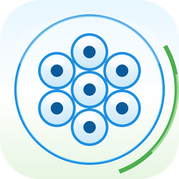
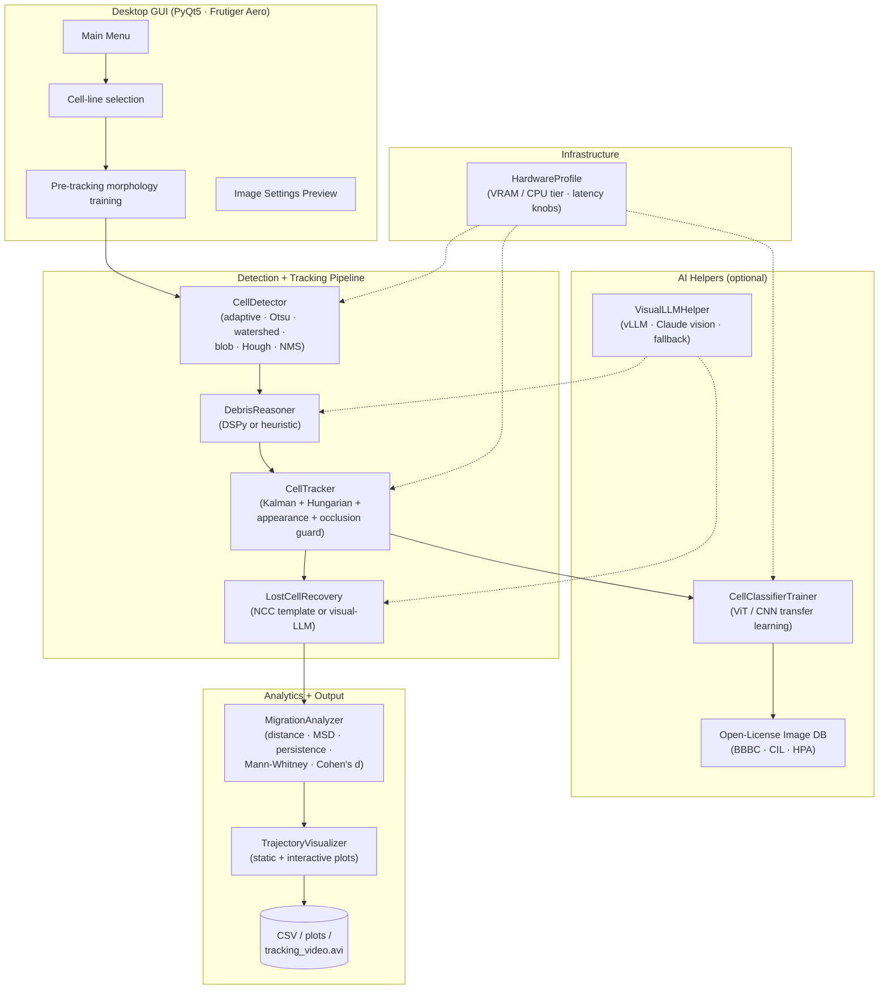
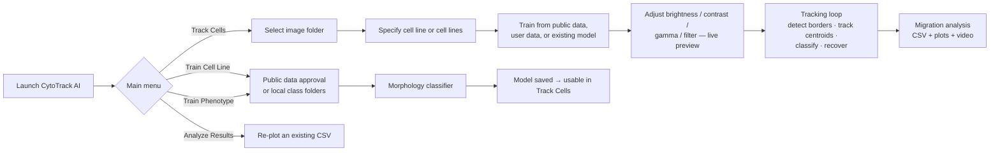

<p align="center">
  
</p>

<h1 align="center">CytoTrack AI</h1>

<p align="center">
  <b>Cell migration tracking &amp; phenotype analysis — desktop, open-source, AI-assisted.</b><br/>
  <sub>Kalman + Hungarian tracking · multi-strategy detector · phenotype classifier training · open-licensed image database search</sub>
</p>

<p align="center">
  
  
  
  
</p>

---

## What is CytoTrack AI?

CytoTrack AI is a desktop application for **quantitative cell migration analysis** on time-lapse microscopy image sequences. It detects cell borders, tracks the **cell center/centroid** across frames with a modern SORT-style tracker (Kalman filter + Hungarian assignment), and produces migration metrics, trajectory plots, dashboards, videos, and publication-ready CSV summaries.

Before tracking starts, the user must specify the cell line or cell lines. CytoTrack AI can then prepare a morphology classifier from public data that the user approves, from user-provided labelled folders, or from an existing trained model. Single-cell-line runs may also use one declared label for all tracks.

The whole interface is a native PyQt5 window with a Frutiger-Aero-inspired theme — no notebook, no browser, no server.

---

## What Users Can Do

CytoTrack AI is built around a full cell-migration workflow:

- **Track cells in time-lapse microscopy movies.** Select a folder of image frames, adjust brightness/contrast/gamma/filter settings, detect cell borders, and track cell centers frame by frame.
- **Train cell-line morphology before tracking.** Enter one or more cell lines, then train from approved public data or from local user-provided folders.
- **Train phenotype classifiers.** Use the same training workflow for phenotypes such as treated/untreated, healthy/diseased, resistant/sensitive, or custom experiment labels.
- **Use public data with approval.** The program searches curated open-licensed public microscopy resources, shows the proposed datasets and licenses, and downloads only after the user approves.
- **Use local laboratory data.** Select a folder with one subfolder per cell line or phenotype; the program checks that requested classes are present before training.
- **Load an existing model.** Reuse a trained `class_map.json` model during tracking.
- **Measure migration.** Export per-cell and per-track measurements such as velocity, total distance, displacement, persistence, confinement ratio, and MSD.
- **Compare cell lines or phenotypes.** Generate statistical summaries and plots for multiple labelled groups.
- **Generate visual outputs.** Save overlay videos, trajectory plots, velocity histograms, displacement plots, rose plots, MSD plots, and interactive Plotly dashboards.
- **Audit tracking quality.** Keep QC manifests, detection repair reports, identity warnings, and settings used for each run.
- **Prepare paper-ready local result folders.** Results are saved locally under `RESULT/` or run-specific output folders and are intentionally not committed to GitHub.

Main menu actions:

| Action | What it does |
| --- | --- |
| **Track Cells** | Runs the full tracking and migration-analysis workflow. |
| **Train Cell Line** | Trains morphology recognition from approved public data or local user folders. |
| **Train Phenotype** | Uses the same training workflow for experiment-specific phenotype labels. |
| **Analyze Results** | Reopens existing CSV outputs and regenerates analysis plots. |
| **Help** | Shows workflow and output guidance inside the app. |

---

## Installation

> The **Windows .exe installer** is the recommended path for end users — it bundles Python and every dependency, places a proper Start-Menu icon, and is uninstallable like any other Windows program.

### Windows — one-click .exe installer (recommended)

You need a Windows machine with Python 3.10+ and [Inno Setup 6](https://jrsoftware.org/isdl.php) (free) to **build** the installer. End users only need the resulting `.exe`.

```bat
REM 1. Build the portable app bundle (includes Python + torch + everything)
build_windows_exe.bat

REM 2. Compile the installer
"C:\Program Files (x86)\Inno Setup 6\ISCC.exe" packaging\installer.iss
```

The installer appears at `installer_output\CytoTrackAI-1.0-setup.exe`. When an end user runs it:

1. Standard Windows installer wizard (admin prompt, destination folder, Start-Menu shortcut, desktop shortcut).
2. Installs into `Program Files\CytoTrack AI\`.
3. Registers an uninstaller in **Add or Remove Programs**.
4. The Start-Menu icon + desktop shortcut both use the CytoTrack AI logo.
5. **No Python install required on the target machine** — every dependency is bundled.

### Windows — run from source

```bat
Setup_Windows.bat
LaunchCellTracker.bat
```

`Setup_Windows.bat` creates a local `cell_track_venv\`, installs everything from `requirements.txt`, and leaves the tree ready for `LaunchCellTracker.bat`.

To install the optional NVIDIA LocateAnything backend, run setup with
`CYTOTRACK_INSTALL_LOCATE=1`. It is not installed by default because it is
under a non-commercial model license.

### Ubuntu / Linux — one-command install

```bash
./install_linux.sh
```

This installs required system packages, creates `cell_track_venv/`, installs Python deps, registers **CytoTrack AI** in the Applications menu, and drops a desktop shortcut. Uninstall with `./uninstall_linux.sh`.

Minimal source-only setup (no desktop integration):

```bash
./setup.sh
./launch.sh
```

To install the optional NVIDIA LocateAnything backend on Linux, run:

```bash
CYTOTRACK_INSTALL_LOCATE=1 ./install_linux.sh
```

The default install remains open-source/research-paper clean and uses the
local classical detector path.

### macOS — source

```bash
python3 -m venv cell_track_venv
source cell_track_venv/bin/activate
pip install -r requirements.txt
python3 main.py
```

A signed `.app` / `.dmg` is not currently provided.

---

## Architecture



Key design points:

- **Accuracy and latency are separated.** `HardwareProfile` tunes only throughput knobs (batch size, worker count, which *optional* detection strategies are on). Core accuracy-affecting parameters (min/max area, IoU threshold, classifier weights) are never touched by the hardware tuner — enforced by a regression test.
- **Every third-party backend is optional.** `DSPy`, `vLLM`, and `anthropic` are soft dependencies; clean classical fallbacks keep the pipeline running without them.
- **Appearance + occlusion guard in the tracker.** Each track keeps an EMA-smoothed grayscale thumbnail *with contextual padding*. When two tracks enter an occlusion zone, a post-solve guard refuses a match if a near neighbour's appearance fits the detection notably better. This is what fixed the "grids jumping between overlapping cells" behaviour.

---

## Typical workflow



### Pre-tracking choices inside **Track Cells**

| Choice | What it does |
|------|--------------|
| **Train Cell Line From Public Data** | Resolve requested cell lines, search licence-checked public microscopy resources, show the proposed sources for user approval, download enough open images where available, then train before tracking. |
| **User Data** | Train from a local folder with one class folder per requested cell line; the folder names are checked before training starts. |
| **Existing Model** | Load a previously trained `class_map.json` model for the requested cell lines. |
| **Single Line Label** | Allowed only for one declared cell line; all tracks are labelled with that line while detection/tracking still uses cell borders and centroids. |

### Output files per run

```
tracking_YYYYMMDD_HHMMSS/
├── tracking_video.avi               — overlay video
├── plot_trajectories.png
├── plot_trajectories_interactive.html
├── plot_velocity_histogram.png
├── plot_displacement_distance.png
├── plot_directionality.png
├── plot_msd.png
├── plot_rose.png
├── migration_detailed.csv           — per-frame per-cell
├── migration_summary.csv            — per-track
├── statistical_comparison.csv       — if ≥2 cell types (t-test / Mann-Whitney / Cohen's d)
├── cell_type_summary.csv
└── settings_used.txt
```

### Per-track metrics

`Total_Distance_um`, `Displacement_um`, `CDE` (confinement ratio), `Avg_Velocity_um_min`, `Max_Velocity_um_min`, `Persistence`, `MSD(τ)`.

---

## Cell-line and phenotype training

Use **Train Cell Line** or **Train Phenotype** from the main menu. Both open the same workflow:

1. Enter one or more cell lines.
2. Choose **Train Cell Line From Public Data** or **User Data**.
3. Approve public data sources before download, or select local class folders.
4. Train the morphology classifier.
5. Use the model during **Track Cells**.

The catalogue ships with curated entries from:

| ID | Dataset | Organism / phenotype | Licence |
|----|---------|----------------------|---------|
| `BBBC005` | Simulated HL-60 leukemia cells | Human / HL-60 | CC-BY-3.0 |
| `BBBC006` | Human U2OS nuclei | Human / U2OS | CC-BY-3.0 |
| `BBBC007` | Drosophila Kc167 | Drosophila / Kc167 | CC-BY-3.0 |
| `BBBC021` | MCF-7 compound panel (week 1) | Human / MCF-7 | CC-BY-3.0 |
| `BBBC038` | Diverse nuclei (DSB 2018) | Mixed | CC-BY-4.0 |

The licence allow-list (`CC-0`, `CC-BY-*`, `CC-BY-SA-*`, `MIT`, `Apache-2.0`, `BSD-*`, `public-domain`) is enforced at both catalogue-registration time and download time — the client simply **refuses** to fetch anything non-permissive. Each download produces a `manifest.json` with the dataset id, licence, upstream URL and authors; each multi-class build produces a top-level `LICENSES.json` summarising every class. Retain both if you redistribute derived models.

You can register extra open-licensed sources at runtime:

```python
from cell_image_library import Dataset, register_dataset
register_dataset(Dataset(
    id="MY-DATA", name="…", organism="…", phenotype="…",
    keywords=["…"], licence="CC-BY-4.0", attribution="…",
    homepage="https://…", download_url="https://…/images.zip",
))
```

Attempting to register a non-open licence raises `ValueError`.

---

## Running the tests

```bash
python3 tests/run_all.py
```

The suite covers the tracker, detector, GUI visibility, self-repair loop, pipeline architecture contracts, public-data training agents, debris reasoning, hardware profiling, lost-cell recovery, overlap-safe tracking, and the open-image-library licence filter.

---

## Project layout

```
CytoTrack_AI/
├── main.py                     — entry point (menu dispatch + tracking flow)
├── src/
│   ├── desktop_gui.py          — PyQt5 GUI (Frutiger Aero style)
│   ├── detector.py             — multi-strategy cell detector
│   ├── tracker.py              — Kalman + Hungarian + appearance + occlusion guard
│   ├── analyzer.py             — migration metrics + statistics
│   ├── visualizer.py           — static + interactive plots
│   ├── classifier.py           — ViT / CNN phenotype trainer
│   ├── cell_image_library.py   — open-license dataset catalogue + downloader
│   ├── hardware_profile.py     — CPU/GPU tier → latency knobs (never accuracy)
│   ├── synthetic_data.py       — test data generator (with overlap-density knob)
│   ├── debris_reasoner.py      — DSPy / heuristic debris judgement
│   ├── ai_assistant.py         — vLLM / Claude-vision optional verifier
│   ├── lost_cell_recovery.py   — template-matching + optional visual-LLM recovery
│   └── image_utils.py
├── tests/                      — 60 unit + integration tests
├── packaging/
│   ├── CytoTrackAI.spec        — PyInstaller spec
│   ├── installer.iss           — Inno Setup .exe installer
│   ├── generate_icon.py        — multi-resolution logo generator
│   └── cytotrack-ai.desktop.in — Linux .desktop template
├── assets/                     — generated PNG + ICO logos
├── install_linux.sh            — Ubuntu one-click install + menu entry
├── uninstall_linux.sh          — removes menu entry / icons
├── launch.sh  ·  LaunchCellTracker.bat
├── Setup_Windows.bat           — source setup (venv + deps)
├── build_windows_exe.bat       — builds PyInstaller bundle
├── setup.sh                    — minimal Linux source setup
├── requirements.txt
└── INSTALL.md                  — user-facing install guide
```

---

## Licensing

CytoTrack AI project source is released under the MIT License; see `LICENSE` and `CITATION.cff`. The application will only download or redistribute data that carries a permissive licence (`CC-0`, `CC-BY-*`, `CC-BY-SA-*`, `MIT`, `Apache-2.0`, `BSD-*`, public domain). If you fine-tune a classifier on datasets fetched via **Train Cell Line From Public Data**, retain the per-download `manifest.json` and the top-level `LICENSES.json` so attributions flow downstream.

Generated `RESULT/` folders are local outputs and are intentionally ignored by Git. For manuscript supplements, keep each run's local `manifest.json`, migration CSVs, videos, plots, dashboards, and QC audits with the paper archive, not in the source repository. Optional non-commercial components such as NVIDIA LocateAnything-3B are opt-in and must be declared in the run manifest if used.

Third-party acknowledgements:

- **Broad Bioimage Benchmark Collection** — Ljosa V., Sokolnicki K.L., Carpenter A.E. (2012).
- **Data Science Bowl 2018** — Caicedo J.C. et al.
- **BBBC021** — Caie P.D. et al. (2010).
- **Drosophila Kc167** — Jones T.R. et al. (2005).

PyTorch, OpenCV, PyQt5, scikit-learn, pandas, SciPy, matplotlib, plotly — each under its own open licence.
